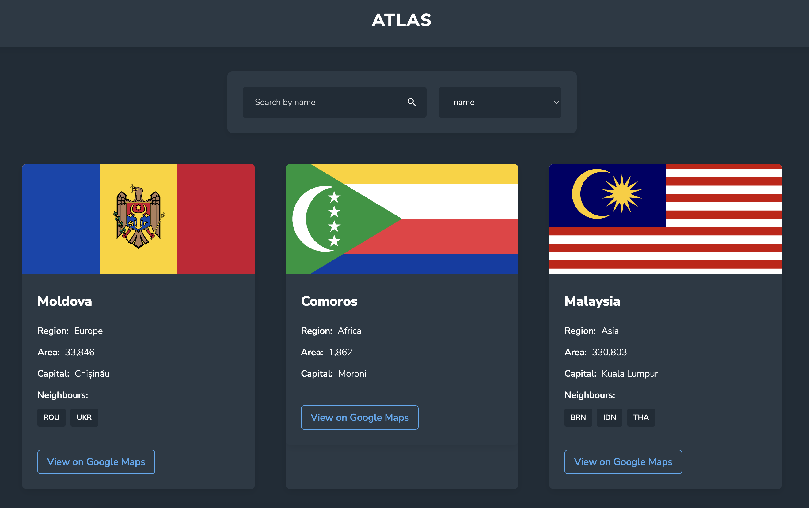

# ATLAS - Country Data Browser
A clean and responsive web application that allows users to explore countries around the world, built with vanilla HTML, CSS, and JavaScript. This project demonstrates proficiency in interacting with a live API, handling asynchronous operations, and manipulating the DOM to create a dynamic user experience.

---

## Live Demo

You can view the live application here: **[ATLAS](https://better-code-saul-e.github.io/Atlas/index.html)**

## Features
* **Live Search:** Dynamically search for countries by name.
* **Filtered Search:** Filter the displayed countries by:
  * Name
  * Currency
  * Capital
  * Language
  * Region 
  * Subregion
* **Detailed Country View:** Displays comprehensive data for each country, including:
  * Flag
  * Native Name
  * Population, Region, and Subregion
  * Capital City
  * Top Level Domain
  * Currencies and Languages
  * Border Countries
* **Responsive Design:** A mobile-first design that ensures a seamless experience on all devices, from phones to desktops.
* **Dynamic Content Loading:** Fetches data from a live API and updates the DOM without page reloads.

## Technologies Used
* **HTML5:** For the structure and content of the application.
* **CSS3:** For all styling, including Flexbox, Grid, and custom properties for theming.
* **Vanilla JavaScript (ES6+):** For all application logic, including:
    * async/await for handling asynchronous API calls with the fetch() API.
    * DOM manipulation to dynamically render countries and handle user events.
    * Data filtering and transformation.
* **[REST Countries API](https://restcountries.com/):** The external API used as the data source for the application.

## Screenshot

